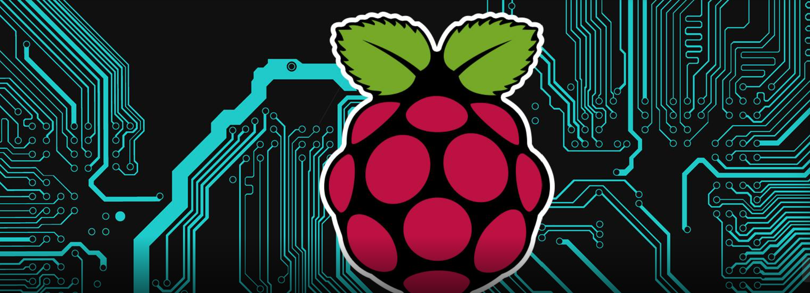

#  raspberrypi-and-diy-projects
<!-- ALL-CONTRIBUTORS-BADGE:START - Do not remove or modify this section -->

<!-- ALL-CONTRIBUTORS-BADGE:END -->

A curated list of Raspberry Pi documentation to help beginner and intermediate Raspberry Pi enthusiasts configure Pi devices and build their projects.

# Other useful resources
* [Raspberry Pi Foundation](https://www.raspberrypi.org/)
* [Official Documentation](https://www.raspberrypi.com/documentation/)
* [Hardware - Official Products](https://www.raspberrypi.org/products/)
* [Software - Raspberry Pi OS (previously called Raspbian)](https://www.raspberrypi.org/software/)
* [Approved Resellers](https://www.raspberrypi.com/resellers/)
* [The Magpi Magazine](https://magpi.raspberrypi.com/)

## Notes for contributors

## Table of contents
1. Beginner Level Projects 
   * [1.1 Flashing LED](docs/section_01/project_01_01.md) 
   * [1.2 Setting up Pi-hole for Network-wide Ad Blocking](docs/section_01/project_01_02.md) 

2. Intermediate Level Projects 
   * [2.1 Overclocking](docs/section_02/project_02_01.md) 

3. Advanced Level Projects 

## Contributors ✨

Thanks goes to these wonderful people ([emoji key](https://allcontributors.org/docs/en/emoji-key)):
<!-- ALL-CONTRIBUTORS-LIST:START - Do not remove or modify this section -->
<!-- prettier-ignore-start -->
<!-- markdownlint-disable -->
<table>
  <tbody>
    <tr>
      <td align="center" valign="top" width="14.28%"><a href="https://github.com/adrianyorke"> <b>Adrian Yorke</b></a> <a href="#maintenance-adrianyorke" title="Maintenance">🚧</a> <a href="https://github.com/adrianyorke/raspberrypi-and-diy-projects/commits?author=adrianyorke" title="Code">💻</a> <a href="https://github.com/adrianyorke/raspberrypi-and-diy-projects/commits?author=adrianyorke" title="Documentation">📖</a> <a href="#ideas-adrianyorke" title="Ideas, Planning, & Feedback">🤔</a> <a href="https://github.com/adrianyorke/raspberrypi-and-diy-projects/pulls?q=is%3Apr+reviewed-by%3Aadrianyorke" title="Reviewed Pull Requests">👀</a></td>
    </tr>
  </tbody>
</table>

<!-- markdownlint-restore -->
<!-- prettier-ignore-end -->

<!-- ALL-CONTRIBUTORS-LIST:END -->

This project follows the [all-contributors](https://github.com/all-contributors/all-contributors) specification. Contributions of any kind welcome!
